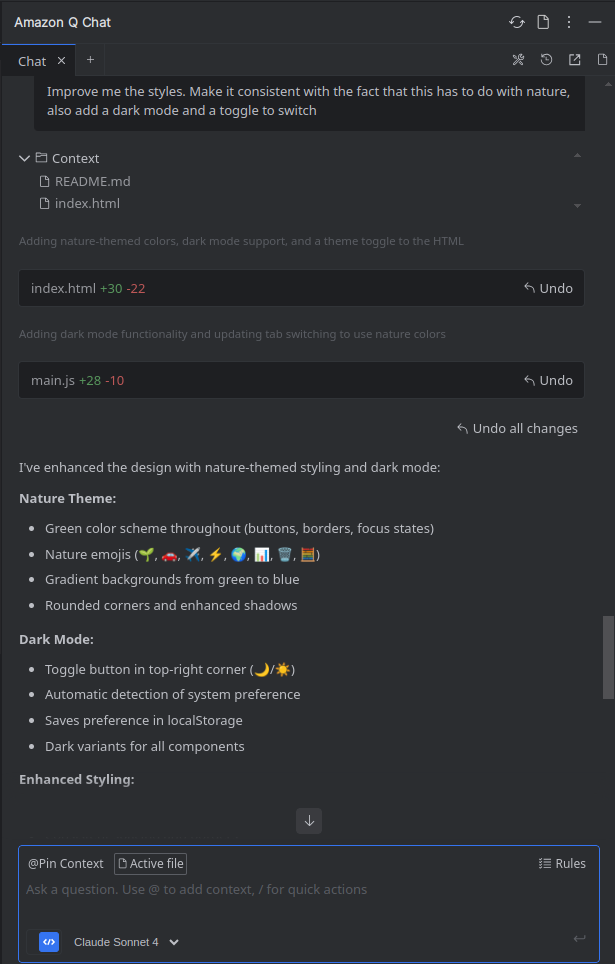

# 🌱 Carbon Footprint Calculator

A modern web application for calculating personal carbon footprint with an intuitive interface and nature-inspired design. Track your environmental impact across different categories and maintain a history of your calculations.

## 🎯 What it does

The Carbon Footprint Calculator helps users estimate their environmental impact by calculating CO₂ emissions from:

- 🚗 **Car Travel** - Calculate emissions based on kilometers driven
- ✈️ **Flights** - Estimate impact from air travel
- ⚡ **Electricity** - Track emissions from power consumption (kWh)

Results are displayed in **kg of CO₂ equivalent** with automatic calculations and smooth animations.

## ✨ Features

- **Category-based calculation**: Switch between car, flight, and electricity tracking with tabbed interface
- **Local history**: Automatically saves your last 10 calculations with timestamps
- **Dark/Light mode**: Toggle between themes with system preference detection
- **Nature-inspired design**: Green color scheme with relevant emojis and gradients
- **Responsive layout**: Works seamlessly on desktop and mobile devices
- **Real-time calculations**: Instant results with smooth fade-in animations
- **Auto-hide results**: Results automatically disappear after 10 seconds or when switching categories

## 🚀 How to run

1. Clone the repository:
   ```bash
   git clone https://github.com/AgustinDiaz14/carbon-footprint-calculator.git
   cd carbon-footprint-calculator
   ```

2. Open `index.html` in your web browser
   - No server or build process required
   - Works offline after initial load

## 🛠️ Built with Amazon Q Developer

This project was developed with the assistance of **Amazon Q Developer** as an AI coding partner:

- **Project structure**: Generated the initial HTML, CSS, and JavaScript architecture
- **UI/UX design**: Helped create the tabbed interface and responsive layout
- **Dark mode implementation**: Assisted with Tailwind CSS dark mode configuration
- **Local storage**: Guided the implementation of calculation history persistence
- **Animation and transitions**: Enhanced user experience with smooth visual feedback
- **Code optimization**: Streamlined JavaScript for better performance and maintainability

Amazon Q Developer accelerated development by providing instant code suggestions, debugging assistance, and best practice recommendations throughout the entire build process.



## 🌍 Emission Factors
The emission factors used (0.21 kg CO₂/km for car, 0.4 kg CO₂/kWh for electricity, 250 kg CO₂ per short flight) are simplified estimates derived from typical values in published studies and databases such as Climatiq, IEA emission factor tables, and average commercial flight emission estimates.

- **Car**: 0.21 kg CO₂ per km
- **Flight**: 250 kg CO₂ per flight (average short-haul)
- **Electricity**: 0.4 kg CO₂ per kWh

## 📱 Technology Stack

- **HTML5** - Semantic markup
- **Tailwind CSS** - Utility-first styling with dark mode
- **Vanilla JavaScript** - No frameworks, pure ES6+
- **Local Storage** - Client-side data persistence